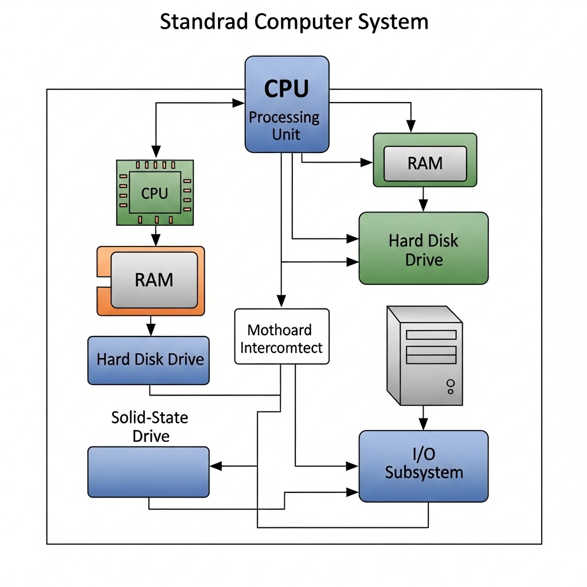

### **Unit 1: Introduction to Computing and Programming (Descriptive Notes)**

**Objective:** To build a foundational understanding of what computers are, how they work, the history behind them, and the role of programming languages in instructing them.

---

#### **1.1 History of Computing and Computers**

The concept of "computing" is ancient, but the electronic computer is a 20th-century invention. The history can be seen as a journey from mechanical devices to complex electronic brains.

*   **Early Mechanical Devices:** Before electricity, humans used mechanical aids for calculation.
    *   **Abacus (~2700 BC):** One of the earliest known calculating tools, used for arithmetic.
    *   **Pascaline (1642):** Invented by Blaise Pascal, it was a mechanical calculator that could perform addition and subtraction.

*   **The Conceptual Leap - Charles Babbage:**
    *   **Difference Engine (~1822):** A mechanical machine designed to automatically compute polynomial tables. A portion was built, proving the concept.
    *   **Analytical Engine (~1837):** This was Babbage's masterpiece and the true conceptual ancestor of the modern computer. It was a general-purpose, programmable machine that had an "ALU" (he called it the "mill") and a "memory" (the "store"). It was never fully built, but its design was revolutionary.
    *   **Ada Lovelace:** A colleague of Babbage, she wrote the first algorithm intended to be processed by the Analytical Engine. She is often considered the **world's first computer programmer**.

*   **The Electronic Era:**
    *   **ENIAC (1945):** The first general-purpose electronic computer. It was massive, filling a large room, using thousands of vacuum tubes for computation. It had to be physically rewired to change its program.
    *   **The Transistor (1947):** Invented at Bell Labs, the transistor replaced bulky, hot, and unreliable vacuum tubes. This was the single most important invention for modern electronics, making computers smaller, faster, and more reliable.
    *   **The Integrated Circuit (IC) (1958):** Jack Kilby and Robert Noyce independently developed the integrated circuit, which placed multiple transistors onto a single silicon chip. This further miniaturized computers.
    *   **The Microprocessor (1971):** Intel created the Intel 4004, the first microprocessor, which put all the components of a Central Processing Unit (CPU) onto a single chip. This paved the way for personal computers (PCs).

---

#### **1.2 Generations of Computers**

The evolution of electronic computers is often categorized into five generations, each defined by a major technological advancement.

*   **First Generation (1940s-1950s):**
    *   **Technology:** Vacuum Tubes.
    *   **Characteristics:** Huge in size, consumed enormous amounts of power, generated immense heat, and were very unreliable. Programming was done in machine language.
    *   **Example:** ENIAC, UNIVAC.

*   **Second Generation (1950s-1960s):**
    *   **Technology:** Transistors.
    *   **Characteristics:** Drastically smaller, faster, cheaper, and more reliable than first-gen computers. Assembly language and early high-level languages like FORTRAN and COBOL were introduced.
    *   **Example:** IBM 1401.

*   **Third Generation (1960s-1970s):**
    *   **Technology:** Integrated Circuits (ICs).
    *   **Characteristics:** Computers became even smaller and faster. Keyboards and monitors were introduced for input/output. Operating systems were developed, allowing the machine to run many different programs.
    *   **Example:** IBM System/360.

*   **Fourth Generation (1970s-Present):**
    *   **Technology:** Microprocessors (VLSI - Very Large Scale Integration).
    *   **Characteristics:** Thousands (and now billions) of transistors were integrated onto a single chip. This led to the Personal Computer (PC) revolution, graphical user interfaces (GUIs), and the internet.
    *   **Example:** Apple Macintosh, IBM PC.

*   **Fifth Generation (Present and Beyond):**
    *   **Technology:** Artificial Intelligence (AI) and Parallel Processing.
    *   **Characteristics:** Focus on creating machines that can learn and make decisions. Quantum computing is an emerging field that promises to solve problems currently intractable for even the fastest supercomputers.

---

#### **1.3 Block Diagram of a Computer**

A computer system, regardless of its size, is composed of four main units that work together.

1.  **Input Unit:** This unit is used to feed data and instructions into the computer.
    *   **Examples:** Keyboard, Mouse, Scanner, Microphone.

2.  **Central Processing Unit (CPU):** The "brain" of the computer. It fetches instructions from memory, interprets them, and executes them. It consists of two main sub-units:
    *   **Arithmetic Logic Unit (ALU):** Performs all arithmetic operations (addition, subtraction, multiplication, division) and logical operations (AND, OR, NOT, comparisons).
    *   **Control Unit (CU):** Acts as the "manager." It controls and coordinates the activities of all other units of the computer. It doesn't process data itself but directs the flow of data between the CPU, memory, and I/O devices.

3.  **Memory Unit:** This unit stores data and instructions.
    *   **Primary Memory (Main Memory):** This is the computer's working memory. It is volatile (data is lost when power is off) and very fast.
        *   **RAM (Random Access Memory):** Where programs and data are stored while the computer is running.
    *   **Secondary Memory (Storage):** This is non-volatile, long-term storage. It is slower than primary memory but can hold vast amounts of data.
        *   **Examples:** Hard Disk Drive (HDD), Solid State Drive (SSD), USB Flash Drive, DVD.

4.  **Output Unit:** This unit presents the processed data (information) to the user.
    *   **Examples:** Monitor, Printer, Speakers.

---

#### **1.4 Types of Computer**

Computers can be classified based on their size, power, and application.

*   **Supercomputer:** The fastest, most powerful, and most expensive type of computer. Used for complex scientific and engineering problems like weather forecasting, climate research, and quantum physics simulations.
*   **Mainframe Computer:** A powerful, large computer used by big organizations for critical applications, such as bulk data processing for banking, insurance, and census data. They are optimized for high transaction throughput.
*   **Minicomputer:** A mid-sized computer, more powerful than a microcomputer but less powerful than a mainframe. They are often used as servers in a network. (This term is less common today, with powerful servers often being categorized as such).
*   **Microcomputer (Personal Computer):** A small, relatively inexpensive computer designed for an individual user.
    *   **Examples:** Desktop, Laptop, Tablet, Smartphone.
*   **Embedded System:** A computer system with a dedicated function within a larger mechanical or electrical system. They are found in almost any modern device.
    *   **Examples:** Computers in cars, washing machines, digital watches, and medical devices.

---

#### **1.5 Software**

If hardware is the physical body of a computer, software is its mind and soul. It is the set of programs, instructions, and data that tells the hardware what to do.

*   **System Software:** Manages the computer's hardware and provides a platform for application software to run. The user does not typically interact directly with it.
    *   **Operating System (OS):** The most important system software. It manages all hardware resources (CPU, memory, storage) and provides services for computer programs. **Examples:** Windows, macOS, Linux, Android, iOS.
    *   **Device Drivers:** Software that allows the OS to communicate with a specific hardware device (e.g., a printer driver).

*   **Application Software:** A program designed to perform a specific task for the end-user. This is the software we use every day.
    *   **Examples:** Microsoft Word (word processing), Google Chrome (web browser), Adobe Photoshop (photo editing), VLC Media Player (media playback), Video Games.

---

#### **1.6 Programming Languages**

A programming language is a formal language used to write instructions that a computer can execute. They act as a bridge between human intentions and machine actions.

*   **Low-Level Languages:** These languages are very close to the machine's hardware.
    *   **Machine Language:** The lowest level, consisting of binary code (1s and 0s). It is the only language a CPU can directly understand. It is extremely difficult for humans to read or write.
    *   **Assembly Language:** Uses mnemonics (short, English-like abbreviations like `ADD`, `MOV`, `SUB`) to represent machine language instructions. It is easier than machine code but is still tied to a specific computer architecture.

*   **High-Level Languages:** These languages use English-like syntax and are designed to be easy for humans to read, write, and maintain. They are machine-independent (portable).
    *   **Examples:** **C**, C++, Java, Python, JavaScript.

*   **Translators:** Since a CPU only understands machine language, high-level languages must be translated.
    *   **Compiler:** A program that translates the *entire* source code (the code written by the programmer) into a machine code file (an executable) all at once. If there are any errors, the program won't compile. C is a compiled language.
    *   **Interpreter:** A program that translates and executes the source code *line by line*. It doesn't create a separate executable file. Python is an interpreted language.

---

#### **1.7 Traditional and Structured Programming Concept**

Programming paradigms are a way of thinking about and structuring code.

*   **Traditional (Unstructured) Programming:**
    *   In early programming, code was often written as one long, continuous sequence of instructions.
    *   The flow of control was managed using `GOTO` statements, which allowed the program to jump to any arbitrary line of code.
    *   This led to what is known as **"spaghetti code"**—a tangled mess of jumps that was incredibly difficult to read, understand, debug, and maintain.

*   **Structured Programming:**
    *   This paradigm emerged in the 1960s to combat the problems of unstructured programming. The goal is to improve code clarity, quality, and development time by using a more organized structure.
    *   The core principle is that any program can be built using only **three basic control structures**:
        1.  **Sequence:** Statements are executed one after another in the order they are written.
        2.  **Selection (Decision):** A block of code is executed only if a certain condition is true. This is implemented with `if`, `if-else`, and `switch` statements.
        3.  **Iteration (Repetition/Looping):** A block of code is executed repeatedly as long as a certain condition is true. This is implemented with `for`, `while`, and `do-while` loops.
    *   By forbidding or discouraging the use of `GOTO`, structured programming forces a logical, top-down flow that is much easier to follow. **C is a structured programming language**, and mastering these three control structures is fundamental to learning it.